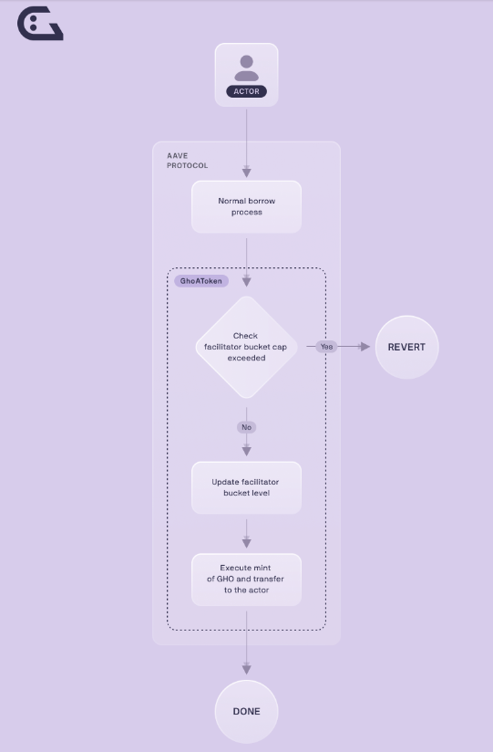

# All I know about GHO 

All links: https://linktr.ee/aavelinks

## GHO

GHO is a decentralized stablecoin native to the AAVE protocol.

### AAVE Protocol 

AAVE protocol is a decentralized finance (DeFi) platform that allows users to lend and borrow crypto.

There are 3 actors in the protocol: suppliers, borrowers, and liquidators
1. **Suppliers**: Users who provide liquidity to the protocol by depositing their cryptocurrencies into a liquidity pool. In return, they earn interest on their deposits.
2. **Borrowers**: Users who draw liquidity from these pools by taking out loans. They need to put up collateral (usually more valuable than the loan they are taking) to ensure the safety of the loan. Borrowers pay interest on the loans they take, which is distributed to the suppliers.
3. **Liquidators**: They play a crucial role in maintaining the health and stability of the AAVE protocol. Their primary function is to monitor loans and ensure that they remain sufficiently collateralized (i.e., the value of the collateral remains higher than the value of the loan). If a borrower's collateral value falls below a certain threshold (due to price fluctuations in the cryptocurrency market), the position is considered undercollateralized and can be liquidated.

*Interacting with GHO on the AAVE protocol is directly as interacting with any other asset of the protocol. - this is what is meant by GHO being native to the Aave Protocol.*

### GHO Properties 
- **Over-collateralized**: Users must supply assets exceeding the value of the GHO they wish to mint.
- **GHO is minted not supplied.**: GHO, unlike other tokens, is minted rather than supplied. When you borrow on the protocol, you receive GHO, which is minted at that moment instead of being drawn from pre-existing supplies. The borrowing rate for GHO is not set by market dynamics but is determined by AAVE governance (1 USD). Additionally, there's a discount mechanism in place for stkAAVE holders, allowing them to borrow at lower rates based on their staked assets.
- **Governed by the Aave DAO**: GHO introduces a new concept called "[facilitators](https://docs.gho.xyz/concepts/how-gho-works/gho-facilitators)." A Facilitator is a  protocol or an entity who are authorized bu the Aave DAO to mint GHO.

### But really - how does it works?
GHO is an ERC20 token designed to maintain a stable value, pegged to the US Dollar.

GHO is minted and burned by the smart contracts on demand when a user borrows and repays from the facilitators.



#### Borrow GHO 
Here are the steps of how the process works:
1. Provide Collateral: User supplies 1 ETH as collateral to the Aave Protocol.
2. Receive aWETH: In return, the user receives 1aWETH.
3. Borrow GHO: The user borrows 10 GHO (this process is known as minting).(There can be a discount on the borrow rate if the user is holding stkAAVE.)
4. Acquire Debt Tokens: Upon borrowing, the user receives 10 debt tokens.
5. Interest Accrual: After a short period, the debt increases slightly to 10.00000008 variableDebtEthGHO due to accrued interest.

#### Supply of GHO 
GHO is not supplied. It is minted by the facilitator on demand.

Important note here is that because there is no supply of GHO, the interst rate are not determined based on the utlization but instread by the Aave governance. 

When the user pays the GHO they have borrowed (aka their debt position) the GHO is burned by the facilitator and the interest is sent to the GHO treasury.

## Building with GHO 

Based on the workshop here: https://github.com/miguelmtzinf/gho-solidity-workshop

#### Set-up
1. Create a project
```sh
forge init lfgho
cd lfgho
```
2. Install the dependencies in the new project repo:
```sh
forge install aave/aave-v3-core@a00f28e aave/gho-core@2abe8f7 OpenZeppelin/openzeppelin-contracts@d00acef
```
3. Configure the remappings.txt
```sh
echo "aave-v3-core/=lib/aave-v3-core/
aave-v3-periphery/=lib/aave-address-book/lib/aave-v3-periphery/
ds-test/=lib/forge-std/lib/ds-test/src/
forge-std/=lib/forge-std/src/
gho-core/=lib/gho-core/
@openzeppelin/=lib/openzeppelin-contracts/
" > remappings.txt
```
4. Add the RPC Url to interact with GHO to foundry.toml
```toml
[rpc_endpoints]
goerli = "https://rpc.ankr.com/eth_goerli"
```


#### Interacting with GHO: Mint GHO 
In order to mint GHO you need to supply collatoral. 

1. Create a test file: 
```sh
touch ./test/GhoTest.t.sol
```
2. Add the following code to the file: 

```Solidity
// SPDX-License-Identifier: UNLICENSED
pragma solidity ^0.8.13;

import "forge-std/Test.sol";
import "forge-std/StdCheats.sol";
import {IERC20} from "aave-v3-core/contracts/dependencies/openzeppelin/contracts/IERC20.sol";
import {IPool} from "aave-v3-core/contracts/interfaces/IPool.sol";
import {GhoToken} from "gho-core/src/contracts/gho/GhoToken.sol";
import {IGhoToken} from "gho-core/src/contracts/gho/interfaces/IGhoToken.sol";

contract GhoTest is StdCheats, Test {
    IERC20 dai = IERC20(0xD77b79BE3e85351fF0cbe78f1B58cf8d1064047C);
    IPool pool = IPool(0x617Cf26407193E32a771264fB5e9b8f09715CdfB);
    GhoToken gho = GhoToken(0xcbE9771eD31e761b744D3cB9eF78A1f32DD99211);

    address WE = address(0x1);

    function setUp() public {
        vm.createSelectFork(vm.rpcUrl("goerli"), 8818553);
        // Top up our account with 100 DAI
        deal(address(dai), WE, 100e18);
        // Take control of GHO token
        address owner = gho.owner();
        vm.prank(owner);
        gho.transferOwnership(WE);
        // We start interacting
        vm.startPrank(WE);
    }

    function testMintGho() public {
        // Approve the Aave Pool to pull DAI funds
        dai.approve(address(pool), 100e18);

        // Supply 100 DAI to Aave Pool
        pool.supply(address(dai), 100e18, WE, 0);

        // Mint 10 GHO (2 for variable interest rate mode)
        pool.borrow(address(gho), 10e18, 2, 0, WE);
        assertEq(gho.balanceOf(WE), 10e18);

        // Time flies
        vm.roll(20);

        // Send 10 GHO to a friend
        address FRIEND = address(0x1234);
        gho.transfer(FRIEND, 10e18);
        assertEq(gho.balanceOf(WE), 0);
        assertEq(gho.balanceOf(FRIEND), 10e18);
    }
}
```

3. Test the function with the following command: 
```sh
forge t --match-test testMintGho
```

---

- Permit: The permit function (provided by the EIP2612) allows another account (or contract) to use the funds by a signed message. This enables single approval/transfer and gas-less transactions.
```Solidity
function permit(
    address owner,
    address spender,
    uint256 value,
    uint256 deadline,
    uint8 v,
    bytes32 r,
    bytes32 s
  ) public virtual
  ```sh